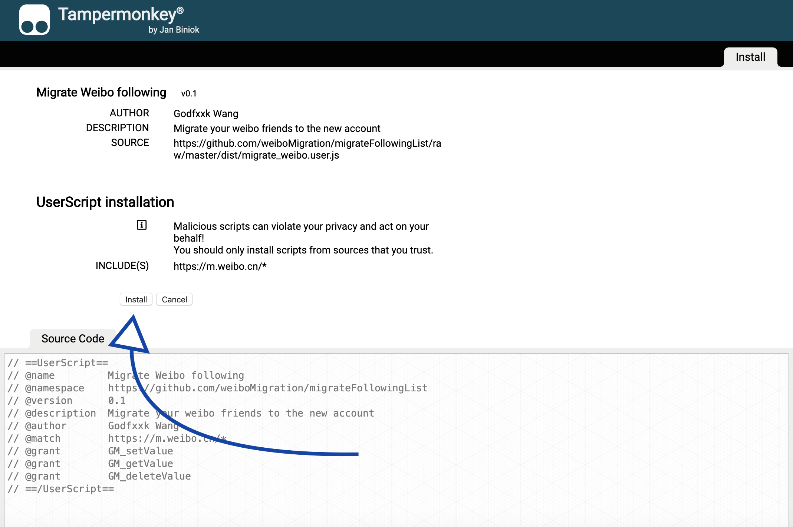
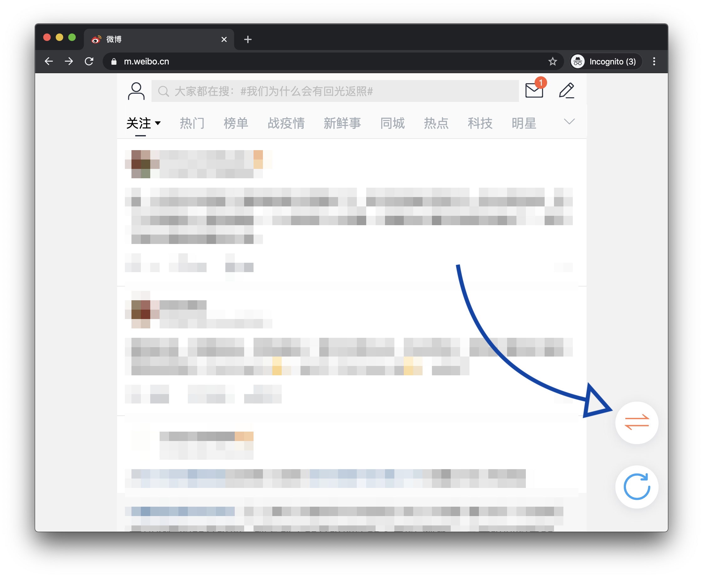
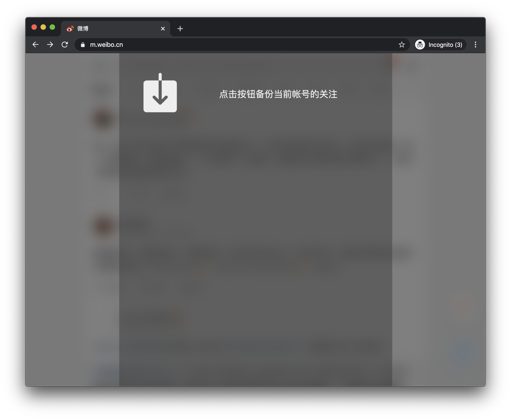
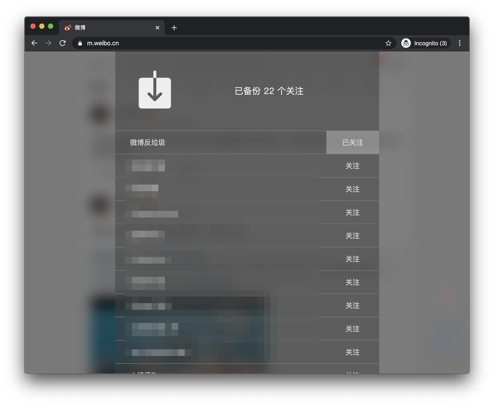

# 微博关注迁移

## 步骤

1. 安装浏览器插件 - TamperMonkey

TamperMonkey 支持 Chrome, Firefox, Edge, Safari, Opera 以及国产浏览器如 QQ, 360 等。选择你常用的浏览器，找到插件中心/网上应用店中搜索TamperMonkey并安装。

注：如遇到Chrome插件中心访问有困难，可以使用国产浏览器

  

2. 安装脚本 - [下载链接](https://github.com/weiboMigration/migrateFollowingList/raw/master/dist/migrate_weibo.user.js)

进入链接后，若TamperMonkey安装成功则应自动跳转到如下页面。点击安装。

  

3. 访问H5版微博 https://m.weibo.cn/

登陆 **老账号**，登陆后记得刷新页面。若脚本安装成功应看见此图标。

  

4. 进行备份

点击图标备份 **老账号** 的全部关注好友

  

5. 恢复备份

登陆 **新账号**，登陆后记得刷新页面。在备份列表中选择关注。

为避免账号关注过于频繁导致异常，建议每次少量关注几十个。

## 隐私

所有数据均存储在你的本地。

## 问题提交

如遇Bug或使用上问题，请访问 [Issues](https://github.com/weiboMigration/migrateFollowingList/issues)